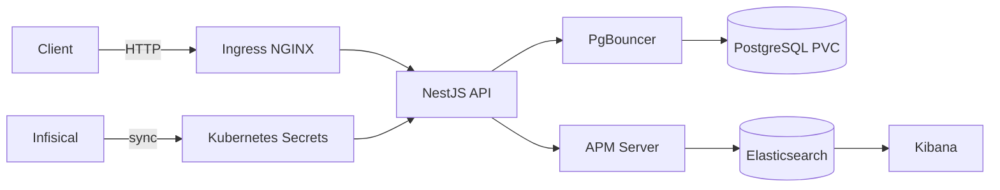
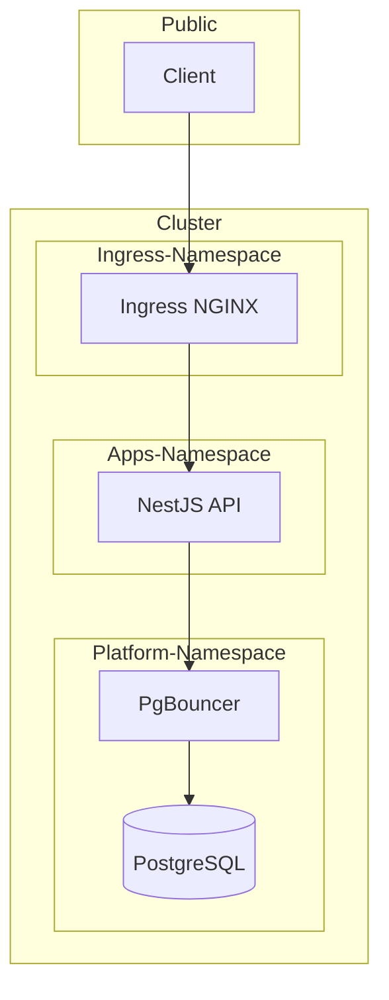
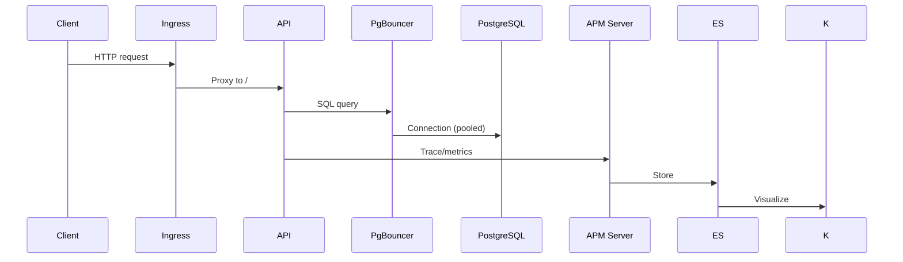
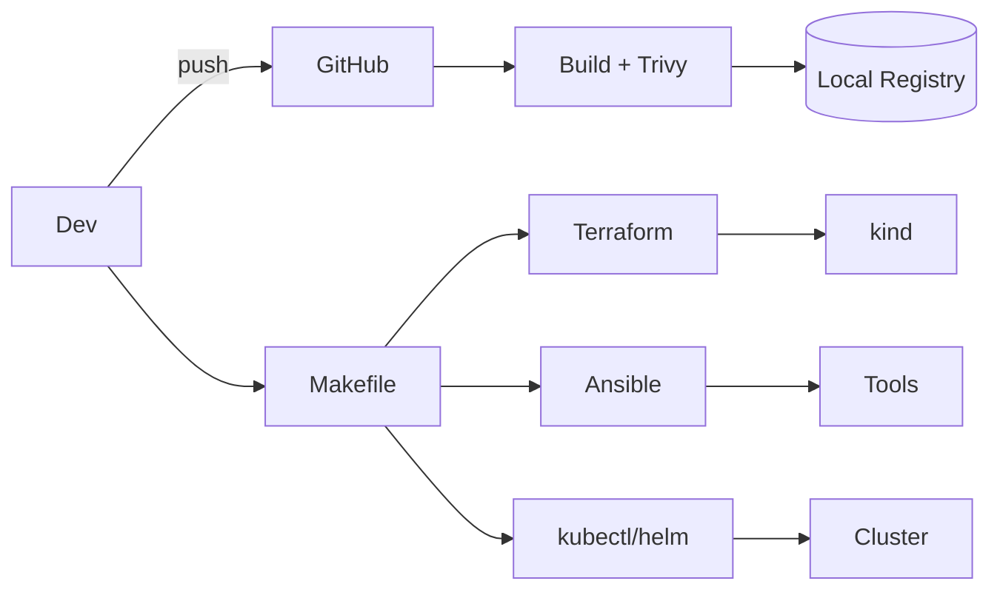

# System Design & Topology

## Components

- **API (NestJS)** → serves REST endpoints with JWT; emits traces/metrics/logs.
- **PostgreSQL** → persistent DB; **PgBouncer** for pooling.
- **Ingress NGINX** → HTTP entry with optional rate limiting.
- **Elasticsearch/Kibana/APM Server** → monitoring, APM, dashboards.
- **Infisical** → secret source; sync to K8s.
- **Terraform/Ansible/Makefile** → automation/IaC.
- **Trivy** → container scanning in CI and locally.

  ## Diagrams (Mermaid)

### System Architecture

### Network Topology & Zones

### Data Flow

### Automation Workflow

